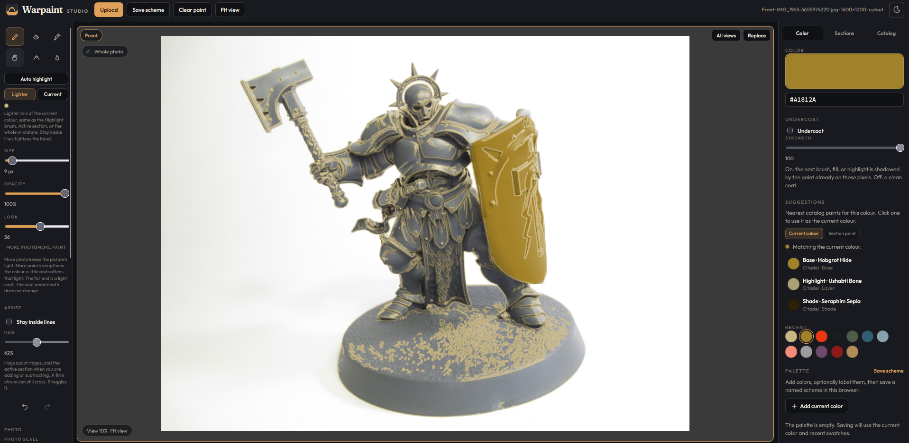
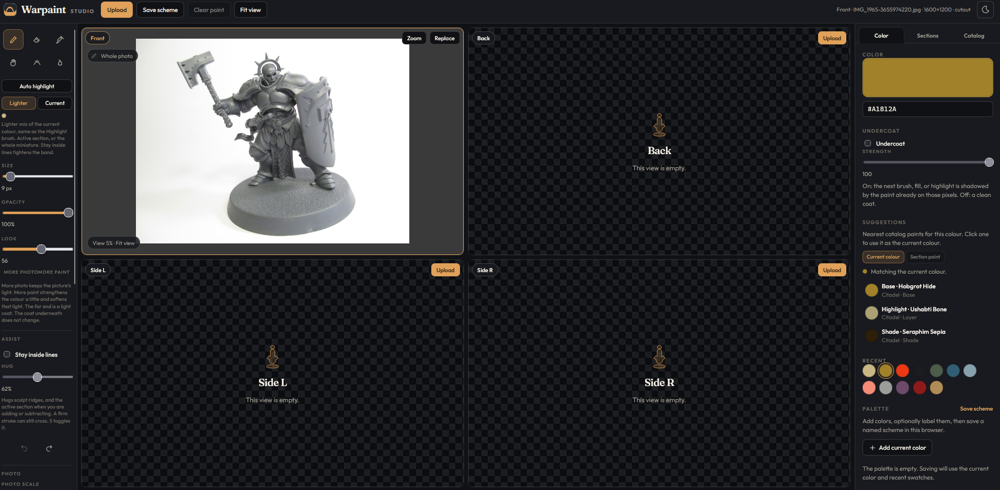
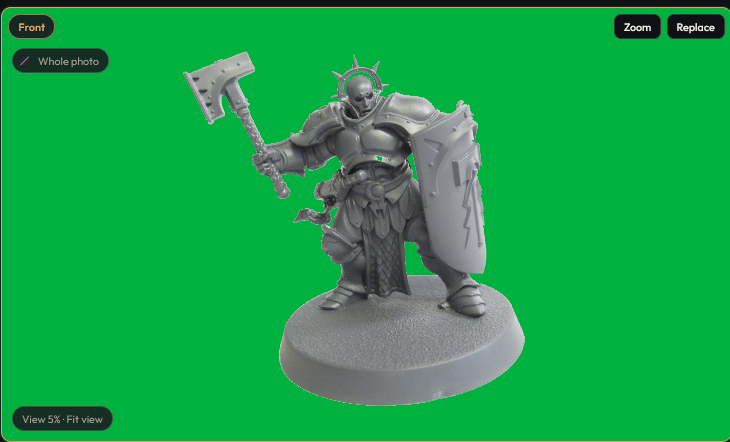
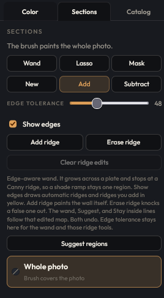
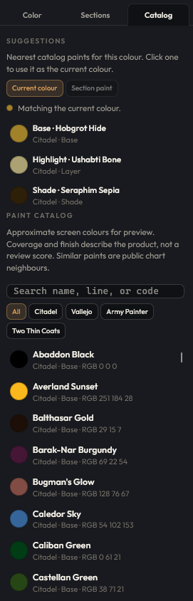

# Warpaint Studio

Preview paint schemes on photos of Warhammer-style miniatures, in the browser. Upload a picture of a painted or unpainted mini and try colours on a layer above it. The photo keeps its light and shadow. This is not a 3D sculpting app, and nothing you paint is uploaded.



*Front view, zoomed. Gold on the shield and trim. Suggestions sit beside the current colour.*

## Features

- **Cutout.** Remove the table or backdrop in the browser, then place the mini on a viewing background.
- **2×2 views.** Front, Back, Side L, and Side R. Click a cell to focus it. Zoom fills the work area with that view. Each view keeps its own paint, sections, cutout, and ridge edits.
- **Sections.** An OpenCV edge wand, lasso, and mask brush select plates. **Suggest regions** splits the mini along sculpt ridges.
- **Editable ridges.** Add or erase ridge walls. Show edges draws them in yellow. The wand, Suggest, and Stay inside lines use that edited map.
- **Paint tools.** Brush, Eraser, Eyedropper, Pan, Highlight, and Fill. The brush is a tint, so edges and recesses stay visible.
- **Stay inside lines.** A soft nudge that hugs sculpt ridges and the active section. Hold Shift for a straight line.
- **Auto highlight.** Paint the raised edges in one step, inside the active section or across the mini.
- **Undercoat.** The next coat is shadowed by pigment already on those pixels. It is not a separate layer.
- **Look.** A 0–100 slider. 0 stays close to the photo. 100 is a light coat, not a flat fill. It opens at 60.
- **Paint catalog and suggestions.** Citadel, Vallejo, Army Painter, and Two Thin Coats neighbours, plus a nearest base, highlight, and shade for the current colour.
- **Viewing backgrounds.** Checker, black, grey, white, green, a custom colour, or a picture. It shows through the cutout and is not painted into the mini.

Swatches are approximate screen colours from public charts, not measured chips.

## A closer look

**Four views.** Front, Back, Side L, and Side R. Click a cell to focus it. Zoom fills the work area with that view, and each view keeps its own paint.



**Cutout.** The backdrop comes off in the browser. A viewing colour, here green, shows through the transparent pixels and is not painted into the mini.



**Sections and the catalog.**

| Sections | Catalog |
| --- | --- |
|  |  |
| Wand, lasso, and mask, plus ridge edits. Suggest regions splits the mini on sculpt edges. | Nearest base, highlight, and shade, then the paint list. |

## Quick start

Node 20 or newer.

```bash
npm install
```

```bash
npm run dev
```

Vite prints a local URL. The default is [http://localhost:5173](http://localhost:5173).

```bash
npm test
```

Drop a photo on the window, or use **Upload**. The first photo lands on Front. A sample picture is at `fixtures/stormcast-acceptance.jpg`. The app does not load it on its own.

## Shortcuts

| Key | Action |
| --- | --- |
| B or 1 | Brush |
| E or 2 | Eraser |
| I or 3 | Eyedropper |
| H or 4 | Pan |
| F | Fill the active section |
| R | Restore photo |
| X | Erase backdrop |
| W | Magic wand |
| L | Lasso |
| M | Mask brush |
| S | Stay inside lines |
| Space (hold) | Pan |
| Scroll | Zoom the focused view |
| [ and ] | Brush size (hold Shift for larger steps) |
| 0 | Fit the focused view |
| Shift+0 | Auto photo scale |
| Shift (hold while drawing) | Straight line from the stroke start to the cursor |
| Ctrl/Cmd+Z | Undo |
| Ctrl/Cmd+Shift+Z or Ctrl/Cmd+Y | Redo |

## Tech stack

React 19, TypeScript, and Vite. OpenCV.js finds sculpt ridges in the browser. Schemes are stored in `localStorage` on this machine. There is no account and no server.

## Not in this version

Lighting presets, mixing two paints by ratio, an in-app tutorial, and STL viewing. Those are listed in `src/roadmap.ts`.

## License

[MIT](LICENSE).
